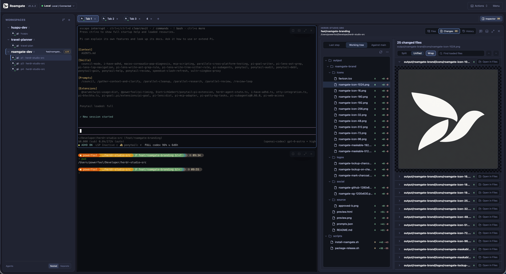
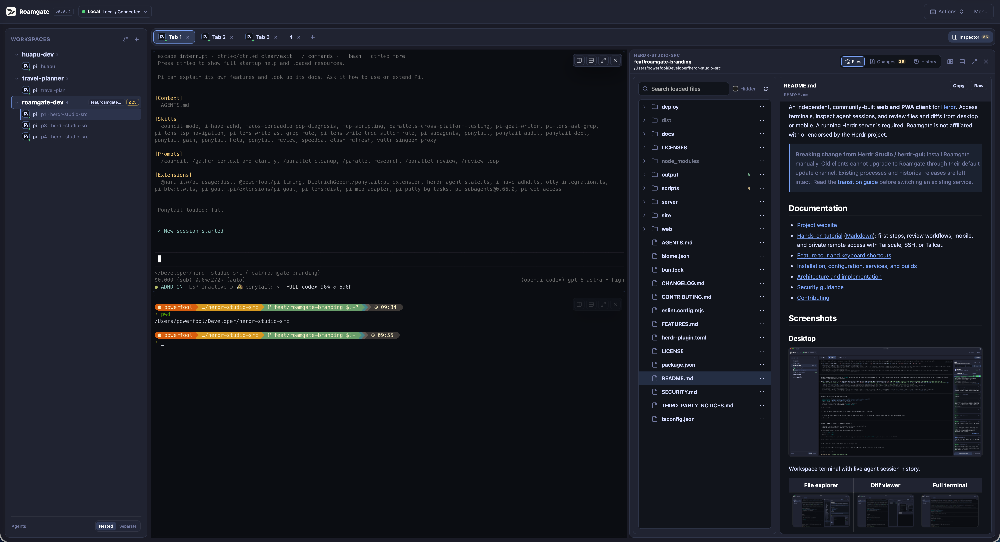
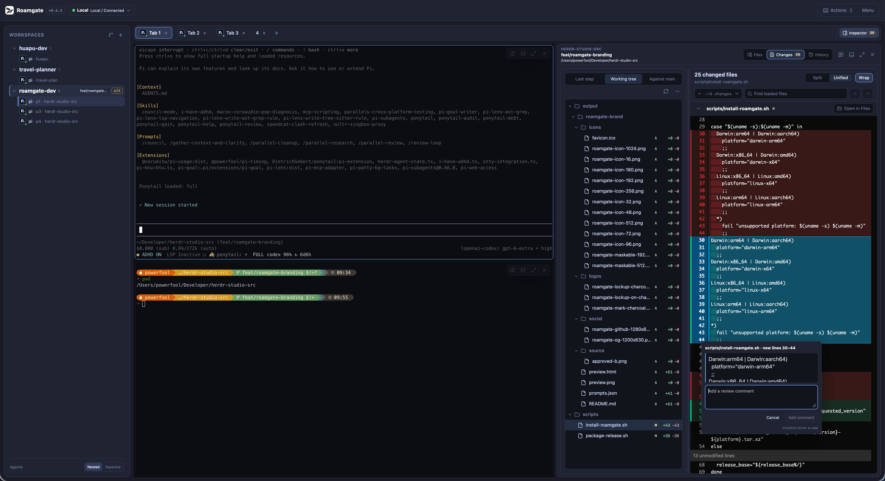
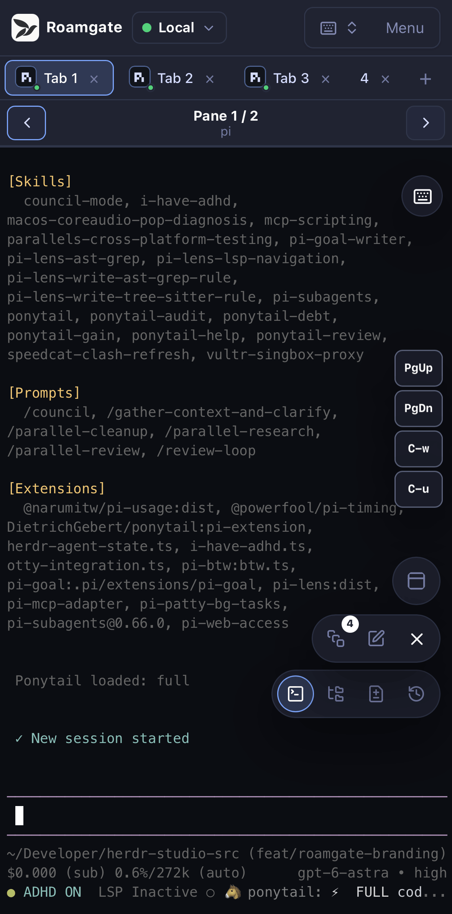

<!-- markdownlint-disable MD033 -->
<!-- Explicit anchors keep section links usable in both GitHub and Pages. -->

# From your first terminal to a workspace that travels

**Start Roamgate on the computer running Herdr, then open its browser URL.**
Follow the standalone or plugin startup steps in [chapter 1](#start).
Not installed yet? Choose an option in the
[installation guide](./DEPLOYMENT.md#install-a-release), then return here.

This hands-on tutorial follows one small task all the way through:
**ask an agent to improve a project README, review its changes, and check its
progress from your phone.** You do not need to learn Git, SSH, and networking
before starting, or finish every chapter in one sitting.

> **Finish one small section first.** With Herdr and Roamgate already installed,
> chapter 1 takes about 5 minutes; the first three chapters take about 25 minutes.
> Allow another 15-25 minutes for remote access, excluding account approvals,
> installation, and network troubleshooting. Each exercise has an observable
> completion check.
>
> This page is a static tutorial, not your workspace. GitHub Pages hosts the
> text and screenshots. **It does not run Herdr, keep your terminals alive, or
> replace the `roamgate` service.**

## 1. Start here: see your own work locally

<a id="start"></a>

### Three names, three jobs

Follow a request from your browser to the process doing the work:

```text
Your browser / installed PWA
          |
          | HTTP + WebSocket
          v
Roamgate (command: roamgate)
          |
          | Herdr control and terminal-render sockets
          v
Herdr server -> workspace -> tab -> pane -> shell / agent
```

**Herdr owns the terminal sessions. Roamgate provides the browser interface.
Your agent is still a CLI running in a terminal.** Roamgate is not a model
provider, and does not install or sign in to Codex, Claude, Pi, or other tools
for you.

Closing the browser does not close Herdr's terminals. Work can continue while
the host, Herdr, and task processes remain running. That does not protect a
task from host sleep, shutdown, or a process exiting.

The plugin/service names below describe the current source build. Published
0.7.0 still uses legacy identities; follow the
[migration guide](./DEPLOYMENT.md#transition-from-herdr-studio--herdr-gui)
before changing an existing service or plugin registration.

### Open your first workspace: about 5 minutes

1. Confirm that Herdr is installed and running on the host, with a project you
   trust open. For Herdr's own installation and introduction, visit
   [herdr.dev](https://herdr.dev). Roamgate does not start Herdr for you.
2. Install Roamgate using the
   [installation guide](./DEPLOYMENT.md#install-a-release). Standalone binaries
   do not require Bun. On Windows, download the matching x64 or ARM64 archive
   and use `roamgate.exe`. Prefer the Herdr plugin? See the
   [plugin instructions](./DEPLOYMENT.md#herdr-plugin).
3. Start Roamgate using the path for your installation:

   **Standalone installation:** run this command in a terminal on that
   computer. Leave the process running.

   ```bash
   roamgate
   ```

   **Plugin installation:** follow the
   [plugin startup instructions](./DEPLOYMENT.md#herdr-plugin) to start Roamgate
   and obtain its login URL from the plugin panel or command log. The plugin
   does not add `roamgate` to `PATH`; skip the standalone command above.

4. In a browser on **the same computer**, open the URL from the standalone
   process or plugin, including any login token. A default standalone launch
   uses `http://127.0.0.1:8787`. Select your workspace, click an idle shell pane,
   and run `pwd`. In Windows PowerShell, use `Get-Location` instead.

**You are done when:** the browser shows your project directory and terminal
input produces output. Leave ports, domains, and VPNs alone for now. Get local
access working before adding another network connection.

> **The two startup defaults differ.** Running `roamgate` directly defaults
> to a local-only listener. The current implementation skips built-in login
> for that listener, even if a password is configured. A new
> `roamgate service install` service instead listens on `0.0.0.0:8787` with a
> login token. The plugin also uses the user service. Check the actual listener
> address before following the private-access examples later in this tutorial.



*Find your project and active pane first. You do not need to identify every
button yet. Screenshots show an existing version; menu positions may change
between releases.*

### Learn this one hierarchy

| Object | What it is | Example in this exercise |
| --- | --- | --- |
| Workspace | A working environment, usually associated with a project directory | Your project repository |
| Tab | A layout within a workspace | A documentation tab |
| Pane | One terminal region within a tab | An agent on the left, tests on the right |
| Worktree | Another real checkout directory of the same Git repository | An isolated documentation branch |

**A pane is not a worktree.** Splitting a pane gives you another terminal. If
both terminals use the same directory, they still modify the same files. Use
chapter 3 when you need to isolate parallel changes.

## 2. Everyday work: verify what the agent changed

<a id="daily"></a>

### 2.1 Find the terminal you want to control

Try `Cmd/Ctrl+K`. The command menu searches workspaces, files, tabs, panes,
and agents. Entering a project-relative path such as `README.md` also opens
that file directly.

1. Select your practice project and create a tab using the interface menu.
2. Split the active pane to the right using its actions menu. On macOS, you
   can also try `Cmd+D`.
3. Run an agent CLI you have already installed and signed in to in the left
   pane. Leave the right pane as an ordinary shell.
4. Press `Ctrl+Tab` to see recent panes. Release `Ctrl` to switch, or press
   `Esc` to cancel.

**You are done when:** you can switch between the agent and shell, and know
which pane will receive your next keystroke.

> Browsers may reserve `Cmd+T`, `Cmd+W`, or `Cmd+D`. Use the interface menus
> when there is a conflict; these shortcuts are usually more reliable in an
> installed PWA. Do not automatically replace every `Cmd` with `Ctrl` on other
> platforms. Check the
> [complete shortcut reference](../FEATURES.md#keyboard-shortcut-reference).

### 2.2 Give the agent a small, reviewable task

Paste this practice prompt into your agent's input, review it, and submit it
yourself. Use a repository you are allowed to modify. Model usage may incur
charges.

```text
Read this project's README and add a short first-run example.
Check the project's actual commands first; do not invent flags.
Modify only the README. Do not install dependencies, commit, or push.
When finished, explain what changed and what you have not actually verified.
```

While the agent works, watch the sidebar or Agent panel. A `working` state
suggests work is in progress; `blocked` usually means something needs your
attention. `done` and `idle` help you decide when to return.

**Status helps you navigate; it does not certify quality.** `done` does not
mean tests passed. Available states depend on Herdr's recognition and
integration with that agent.

Open message history with `Cmd/Ctrl+Shift+H` to revisit the conversation.
For more detail, use **Session Inspector** to view the Timeline, ATIF, or raw
transcript. ATIF is a normalized trajectory representation for use by other
tools; the original export preserves the source record.

**You are done when:** you have found the agent's explanation of this change,
not just the last line in the terminal.

> Session inspection currently supports Codex, Claude, Kimi, Grok Build, and
> Pi, provided a session record is readable. Follow the interface's integration
> hints when metadata is missing. In remote mode, session paths reported by
> Herdr are read remotely, and Pi session IDs support remote lookup. Other
> fallback searches that depend on local IDs or directories may not find a
> remote transcript.

### 2.3 Read the file, then the diff

1. Open **File Explorer** with `Cmd/Ctrl+Shift+E` and find `README.md`.
2. Switch between **Raw / Rendered** to check both the source and formatting.
   Previews also support images, Mermaid diagrams in Markdown, and standalone
   Mermaid files.
3. Open **Diff Viewer** with `Ctrl+Shift+G`. Select the working-tree scope and
   inspect the README's added and removed lines.
4. Use `Cmd/Ctrl+F` in the diff to find the command the agent added. Confirm
   that it actually exists in the project's configuration.

**You are done when:** you can identify the new lines and explain whether the
run command is correct, rather than repeating the agent's summary.



*File Explorer explains a file; Diff Viewer explains a change. File-tree search
covers files already loaded into the tree, not a repository-wide full-text
search.*

You can also manage files here. Right-click on desktop or long-press on mobile
to open actions. Drag files in to upload them, download individual files, or
download a directory as a `.tar.gz` archive. Use `Cmd/Ctrl+Click` on a file path
in terminal output to preview it. **Uploads, deletions, and SSH-backed file
operations affect real files on the target host, not browser-only copies.**

### 2.4 Send precise feedback back to the agent

Instead of typing "this part is wrong," select the exact place to change:

1. Click or drag across diff line numbers and add a specific comment, such as
   "Use the dev command that actually exists in package.json here." Source-file
   annotation gutters and text selections in rendered Markdown also support
   comments.
2. Organize the comments in the review panel. Check their files, line ranges,
   and quoted content.
3. Choose the target agent pane and pre-fill its terminal input with the
   compiled feedback.
4. Return to that pane, review the full message, and press Enter yourself.

**You are done when:** the agent receives feedback with a file location and
context. **Pre-filling does not submit the message**, so you retain a final
review opportunity.

Annotation drafts stay in the current browser, scoped to the checkout. They
are not GitHub PR comments and do not automatically sync to another device.
When a changed file prevents re-anchoring, the comment is marked stale and its
original quote remains available for inspection.



### 2.5 Do not rush into bulk actions

Diff Viewer distinguishes staged, unstaged, untracked, and conflicted files.
File actions can stage or unstage matching changes, while **More Git actions**
contains operations that affect multiple files.

**For this exercise, stop when the review is satisfactory; a commit is not
required.** If you do want to commit, run `git status` in the ordinary shell
first, then follow the project's testing and commit process. Staging is not
committing, and committing is not pushing.

> **Discarding and deleting do not just tidy the interface.** Discard Unstaged
> removes changes that have not been staged; Delete Untracked deletes
> untracked files. A confirmation dialog is not a backup. When uncertain,
> cancel and preserve the files first.

## 3. Parallel work and mobile access

<a id="workflow"></a>

### 3.1 When do you need a worktree?

Suppose the documentation task and a bug fix need to run at the same time,
and both will edit files. Give them separate worktrees. Each has its own
directory and checked-out branch, making review easier than having two agents
write into the same directory.

1. Confirm that the repository has a fetchable `origin/main`, and inspect
   `paseo.json` if it exists. If you do not trust its commands, disable hooks
   for this repository through **Worktree hooks** before proceeding.
2. Open **Worktree Lifecycle** from the workspace context menu, or search for
   `worktree lifecycle` in the command menu.
3. Create and open a documentation worktree. Roamgate starts it from the latest
   fetched `origin/main`, without carrying over the source workspace's
   uncommitted changes.
4. In the new worktree's terminal, run `pwd` and `git status`. Confirm the
   directory and branch before starting the agent.

**You are done when:** the tasks live in different checkouts, with changes you
can review independently. The sidebar can group, collapse, and pin worktrees
from the same repository; these display preferences stay in the current
browser.

> The setup, opened, teardown, and removed hooks in `paseo.json` execute
> repository commands. They are enabled by default and run remotely in SSH
> mode. Before removing a worktree, save or commit the results you want to
> retain, confirm its tasks have ended, and read the removal confirmation.
> A hook failure can also block removal. See
> [hook timing and boundaries](../FEATURES.md#paseo-worktree-hooks).

**Automatic branch updates** are optional. By default, they fetch `origin/main`
every 10 minutes and try to merge it into the current branch of an enabled
checkout. This is not automatic pushing. Dirty workspaces and detached HEADs
are skipped, and conflicting merges are aborted. Updates run only while that
workspace is open in the current Roamgate connection. Leave this off for your
first exercise; enable it once you are comfortable managing changes manually.

### 3.2 Continue from your phone

Complete chapter 4's **Tailscale + Serve** setup and access-policy checks
first, then open its HTTPS address on your phone. On a phone, `127.0.0.1`
means the phone itself, not your work computer.

1. Open Roamgate in the mobile browser and select your practice project and
   agent pane. Authenticate first if your deployment requires login.
2. Use the floating terminal panel for arrow keys, Ctrl, and other actions
   that are awkward on a touch keyboard. Customize its two shortcut rows
   as needed.
3. Open Changes to review the README diff. Mobile uses a unified diff layout;
   long-press a file to open its actions menu.
4. Adjust **Menu > Appearance > Text size** (80%-150%), then use the relevant
   platform entry below to install the PWA.

| Browser / device | Installation entry |
| --- | --- |
| iPhone / iPad Safari | Share > Add to Home Screen |
| macOS Safari 17+ | File > Add to Dock |
| Chrome / Edge | Browser menu > Install app |

**You are done when:** a Roamgate icon on your home screen opens the same
project. Confirm that the service address is stable before installing. Install
your Roamgate URL, not this tutorial's Pages URL.



*On a small screen, start with one action: check an agent waiting for your
input, inspect a diff, or add feedback. You do not need to reproduce an entire
desktop workflow on your phone.*

A PWA is a standalone window, **not an offline terminal or a background
keep-alive mechanism**. Host sleep, a stopped Roamgate process, or a disconnected
VPN can interrupt access. Browser task-completion notifications can take you
back to a pane, but delivery depends on browser permissions and operating
system background restrictions. Do not treat them as a reliable alerting
service.

### 3.3 Multiple browsers are not separate permission roles

Your computer and phone can connect to the same bridge and receive Herdr
events. Connection controls can pause the current browser or other clients.
That does not synchronize every browser's font settings, annotation drafts,
pinned items, or shortcut preferences.

**Server profiles in the connection selector are shared; each browser chooses
which connection to display independently.** Adding or editing a profile
changes the connection list available to other authenticated users. Roamgate
does not provide a per-person read-only reviewer role. Do not share a workspace
URL as if it were an ordinary document link.

## 4. Remote access: choose the right connection

<a id="networking"></a>

**For regular access from your own phone or computer, start with Tailscale +
Serve.** If you can already SSH to the work machine and only need access from
another computer, SSH is another option. Keep Tailcat for temporary experiments
between two computers you control.

| Your goal | Recommended route | What you need |
| --- | --- | --- |
| Use Roamgate on the computer running Herdr | Local Roamgate | No extra networking tool |
| Reach the workspace from your phone away from home | Tailscale + Serve | Host and phone in the same tailnet |
| Manage remote Herdr through local Roamgate | SSH profile / `--ssh-host` | Local Linux/macOS, Herdr already running remotely |
| Connect two computers temporarily without a tailnet | Tailcat port forwarding | Tailcat on both ends and a securely exchanged address |

**These are combinations with external tools, not built-in Tailscale or Tailcat
integrations.** You do not need router port forwarding, an exit node, or subnet
routing for this tutorial. The examples were checked against source code and
official documentation, not tested on your devices or network. Complete the
checks for your chosen route before relying on it regularly.

### 4.1 Separate the two network hops

```text
Hop A: Browser -> Roamgate
       Tailscale Serve / SSH TCP forwarding / Tailcat port forwarding

Hop B: Roamgate -> Herdr
       Local sockets / a Roamgate SSH profile
```

The Tailscale and Tailcat examples solve **hop A**, bringing your browser to
Roamgate. `--ssh-host` solves **hop B**, bringing Roamgate to remote Herdr. You can
combine them, but start with the hop you actually need.

#### Safety checks before connecting

1. Allow only your devices or people you fully trust. Access to the Roamgate UI
   is effectively terminal and file access as the user running Roamgate.
2. **The current implementation skips built-in authentication for listeners
   configured as `127.0.0.1`, `localhost`, or `::1`, even with
   `ROAMGATE_PASSWORD` set.** Forwarding one of these listeners makes the
   outer tunnel or proxy the access boundary. There is no extra Roamgate
   password gate.
3. Prefer HTTPS or a trusted encrypted tunnel, and restrict listener addresses
   and access policies. A password is not TLS, rate limiting, multi-user
   authorization, or a sandbox.
4. Keep passwords, token login URLs, and Tailcat addresses out of screenshots,
   public issues, group chats, and example configurations.

See [SECURITY.md](../SECURITY.md) for the full trust model. The examples below
configure private access, not public publishing. If you require an additional
application login for remote access, stop here and use an independently
authenticated proxy design: these loopback examples do not meet that
requirement. Do not switch to `0.0.0.0` just to force password authentication;
that also expands the exposed network surface.

<a id="tailscale"></a>

### 4.2 Tailscale + Serve: the recommended everyday option

**Tailscale** connects authorized devices in a private network called a
**tailnet**. Traffic uses WireGuard encryption, with direct connections where
possible and relays when needed. **Serve** exposes a local HTTP service through
an HTTPS address reachable within that tailnet.

```text
Phone browser (connected to Tailscale)
          |
          | HTTPS, restricted by tailnet access policy
          v
Tailscale Serve on the work computer
          |
          | HTTP, local loopback only
          v
127.0.0.1:8787 -> Roamgate -> local Herdr
```

#### Prepare both devices: about 5-10 minutes

1. Install [Tailscale](https://tailscale.com/download) on the work computer and
   visiting device. Sign in to the same tailnet and confirm that both appear
   online in the admin console.
2. Run `tailscale status` on the work computer. If the CLI is missing on macOS,
   follow the [official macOS instructions](https://tailscale.com/docs/install/mac)
   to configure its command entry. Do not install multiple client variants
   just to fix a PATH problem.
3. Follow the [access-control documentation](https://tailscale.com/docs/features/access-control)
   to allow only the intended users or devices to reach HTTPS port 443 on the
   Roamgate node. Check whether existing broad rules still allow other access.
   Membership in the same tailnet does not automatically imply least
   privilege. These rules determine who gets full Roamgate access; do not
   enable Serve before confirming their scope.

#### Start Roamgate with a local-only listener

Run this on **the work computer running Herdr**. Port 8787 must be free. If
Roamgate already runs through the plugin or a user service, do not start a second
instance; use the existing-service instructions below instead.

```bash
roamgate --host 127.0.0.1 --port 8787
```

On Windows, use `roamgate.exe`, usually `./roamgate.exe` when launching from
the current PowerShell directory. Leave this terminal running Roamgate.

> **This setup has no Roamgate login page under the current implementation.**
> HTTPS protects transport; Tailscale device identity and access rules control
> remote admission. Devices allowed to reach this HTTPS endpoint enter the
> workspace directly. Other local processes can also access loopback. Continue
> only if you understand and accept this boundary.

**Already using a user service?** Edit
`~/.config/roamgate/roamgate.env` on Unix or
`%APPDATA%\roamgate\roamgate.env` on Windows. Preserve other necessary
settings, set `HOST` to `127.0.0.1`, and set `PORT` to `8787`. Changing from a
non-loopback listener to loopback removes the existing token or password login
gate; the Tailscale policy above must take over remote admission. The config
may contain secrets. Restrict file access and do not commit it to Git. Then
restart the service using the command for your installation:

**Standalone installation:**

```bash
roamgate service restart
```

**Plugin installation:**

```bash
herdr plugin action invoke roamgate.restart
```

Plugin actions run asynchronously. Confirm the restart in the plugin panel
or command log before continuing.

The [deployment guide](./DEPLOYMENT.md#run-as-a-user-service) is the canonical
reference for service installation, configuration, and logs.

#### Connect from another terminal on the same work computer

1. Check for existing Serve configuration you need to preserve:

   ```bash
   tailscale serve status
   ```

2. Once you have confirmed that HTTPS port 443 at the root path is available
   on this node, create the proxy. If another service already uses that
   endpoint, stop and plan a separate port or node using the official
   documentation. Do not overwrite it.

   ```bash
   tailscale serve --bg --https=443 http://127.0.0.1:8787
   ```

   The first run may provide a consent link for enabling tailnet HTTPS
   certificates. Have an authorized administrator approve it. Certificate
   hostnames appear in public certificate transparency logs, so do not put
   sensitive information in machine names.

3. On your Tailscale-connected phone, open the printed address, shaped like
   `https://machine-name.tailnet-name.ts.net`. **Use the printed HTTPS hostname,
   not a bare IP address or localhost on your phone.**
4. Run `pwd` in an idle shell pane to verify terminal interaction. Test that a
   tailnet device excluded by your access rules cannot connect; if you have
   no suitable test device, at least verify the denial using policy tests.
   With Tailscale disconnected and no other access path, the HTTPS endpoint
   should also be unreachable.

**You are done when:** the phone can control the terminal over cellular data
with Tailscale connected, while devices outside the access policy cannot open
the service. An incognito window is not an admission test: it does not change
the device's Tailscale identity.

> **Serve is not Funnel.** Serve is for your tailnet; Funnel is public. Do not
> replace `serve` with `funnel` because the names look similar. Serve's identity
> headers do not automatically give Roamgate per-person authorization or
> read-only roles. Mount the proxy at the domain root `/`; do not assume Roamgate
> supports an arbitrary `/studio/` subpath.

#### Stop sharing, or make it a regular setup

To close the endpoint created above, first confirm that doing so will not
affect other mounts, then use its matching off command:

```bash
tailscale serve --bg --https=443 off
tailscale serve status
```

Do not casually run `tailscale serve reset`: it clears that device's Serve
configuration and may affect other services. `--bg` keeps Serve configured
persistently; **it does not start Roamgate or prevent host sleep**. Once the
setup is verified, use the deployment guide to configure a Roamgate user service
if needed, retaining loopback binding and strict Tailscale access rules.

<a id="ssh"></a>

### 4.3 SSH: connect to Herdr, or forward the web interface

#### Option A: local Roamgate, remote Herdr

Use this when code and agents run on a Linux work machine while your browser
runs on a Mac, for example. Roamgate SSH profiles and `--ssh-host` currently
require **Roamgate itself to run on Linux or macOS**. Windows Roamgate supports
native local profiles, but not this Unix socket forwarding transport.

1. Verify connectivity with system SSH, confirm the host fingerprint, and check
   authentication and the already-running remote Herdr server. Put custom
   ports, jump hosts, and keys in local `~/.ssh/config`; for example, configure
   the destination as the alias `workbox`.
2. In local Roamgate, add an SSH profile through the connection selector beside
   the title. Set Destination to `workbox`, leaving the control and render
   socket paths empty for automatic resolution.
3. Test and connect using the selector. Open the remote project and run `pwd`
   in its terminal to confirm the directory.

Alternatively, start a local bridge with the command below. Its port must not
conflict with an existing Roamgate instance.

```bash
roamgate --ssh-host workbox --host 127.0.0.1
```

**You are done when:** your local browser controls the remote terminal and
shows remote project files. Image uploads, Git operations, file operations,
and worktree hooks execute on that same remote host, not on copies pulled to
your local computer.

Explicit `--socket-path` / `--client-socket-path` settings, or their environment
variables, override automatically forwarded paths. Old settings can point you
at the wrong target. SSH profiles do not store passwords or private keys;
OpenSSH still controls host-key verification and authentication. See
[multiple and remote connections](./DEPLOYMENT.md#multiple-and-remote-herdr-connections).

#### Option B: Roamgate already runs remotely; forward its web port

This differs from `--ssh-host`: both services stay remote, while system SSH
forwards one TCP port. Remote Roamgate should listen on loopback. This skips
Roamgate login, so remote admission relies on SSH authentication. Local processes
on the visiting computer can also use its forwarded port. The visiting
computer needs OpenSSH; Windows OpenSSH works for this option too.

Run this on the visiting computer, replacing `workbox` with your SSH alias:

```bash
ssh -N -o ExitOnForwardFailure=yes -L 127.0.0.1:18787:127.0.0.1:8787 workbox
```

Open `http://127.0.0.1:18787` on that computer. HTTP travels only across
loopback at each end; SSH encrypts the link between them. This tunnel runs on
the visiting computer and is not directly a phone-access URL.

**Press Ctrl+C in the SSH forwarding terminal when finished.** `-N` means no
remote command is executed, `18787` is the local port, and the final `8787` is
the remote Roamgate port.

<a id="tailcat"></a>

### 4.4 Tailcat: a temporary link between trusted computers

**Tailcat is a separate open-source tool from the Tailscale team, not another
spelling of Tailscale.** It reuses WireGuard, NAT traversal, and DERP relays,
but does not require a Tailscale account or tailnet control plane. It does not
provide a long-term device directory and access-policy management for you.

Think of it as a temporary connection to selected ports. Privately send the
server's printed Tailcat address to your other computer, where the client maps
a remote port to localhost. Your browser does not need to understand Tailcat.

> **Experimental boundaries.** Upstream makes no CLI, API, or wire-format
> stability promises, and its public relays have no availability or throughput
> SLA. The threat model primarily targets connecting your own devices. The
> example below was checked against the referenced upstream README, but has
> not had a two-machine end-to-end test in this project. Check both versions
> and `tailcat --help`, `tailcat serve --help`, and `tailcat forward --help`.
> Continue only after confirming support for `serve`, `forward`, and
> `--key=new`. Update older versions using official instructions rather than
> guessing flags.

#### Prepare both ends

Install a supported version on both computers using the
[official Tailcat repository](https://github.com/tailscale/tailcat#install).
Upstream's macOS options include `brew install tailcat`; on other systems,
choose the appropriate architecture from official releases. **This example
does not treat the experimental Tailcat web demo as a general-purpose Roamgate
proxy or assume that phones can run these CLIs.** Prefer Tailscale for regular
mobile access.

#### Connect only the Roamgate port

1. Run Roamgate on the work computer at `127.0.0.1:8787` and verify its local
   page. **This listener has no Roamgate login gate. The experiment relies
   entirely on Tailcat admission; leaking the address leaks access to the
   workspace.** Use only two computers you control, not a demo for other people.
2. In another terminal on the work computer, start a temporary single-port
   service:

   ```bash
   tailcat serve --key=new 8787
   ```

   `--key=new` forces an ephemeral key, avoiding reuse of a previously shared
   address when a saved key named `default` already exists. Confirm that the
   output says it is using a new address.

3. Send the complete printed `tc...` address through a trusted private channel
   to the visiting computer. Run this there, **replacing
   `tcREPLACE_WITH_PRIVATE_ADDRESS` first**:

   ```bash
   tailcat forward tcREPLACE_WITH_PRIVATE_ADDRESS 18787:8787
   ```

   Upstream's `forward` binds to `127.0.0.1` by default. Verify that in its
   output; do not add `--bind=0.0.0.0`.

4. On the visiting computer, open `http://127.0.0.1:18787` and run `pwd` in an
   idle shell pane to verify interaction.
5. When finished, press Ctrl+C in both Tailcat terminals. Confirm the visiting
   computer's address no longer works. Once the ephemeral server exits, the
   old address no longer corresponds to a running service.

```text
Visiting browser -> 127.0.0.1:18787 -> tailcat forward
                                          |
                                 WireGuard encryption
                                 (direct or via DERP)
                                          |
Work host: Herdr <- Roamgate :8787 <- tailcat serve
```

**You are done when:** the other trusted computer can use Roamgate without a
public listener, and the old entry point stops working after both forwarding
processes exit.

Treat a Tailcat address as a sensitive connection credential. Current upstream
default addresses include a pre-shared key, not just a public hostname. Keep
the default protections and avoid compatibility options that weaken them.
**Do not switch to `serve all`, exit-node mode, authentication-free SSH, or
writable-directory sharing for convenience.** Each expands this experiment's
permission scope.

#### Which one should you choose?

| Consideration | Tailscale + Serve | Tailcat |
| --- | --- | --- |
| Best fit | Regular private access across your devices | A short-lived connection between your computers |
| Who gets access | Tailnet identity and policy; no Roamgate login gate in this example | The connection address and optional client restrictions; no Roamgate login gate in this example |
| Browser entry | A private HTTPS hostname | Localhost exposed by the client CLI |
| Ongoing responsibility | Maintain device sign-ins, policies, and services | Protect the temporary address, check versions, and stop processes |

Neither tool guarantees a direct connection on every network. A DERP relay
does not mean encryption is disabled, but performance may differ from your LAN.

## 5. Troubleshoot the hop that failed

<a id="troubleshooting"></a>

### A page will not open: check in order, about 3 minutes

1. On the **Roamgate host**, probe its HTTP service:

   ```bash
   curl -fsS http://127.0.0.1:8787/healthz
   ```

   Use `curl.exe` in Windows PowerShell. This is a service probe, not proof
   that every Herdr feature works. For a refused connection, check the Roamgate
   process, port, and service status before changing the VPN.

2. Open Roamgate locally on its host, authenticating first for a non-loopback
   deployment. If the page appears but the terminal does not, check that
   Herdr is running, the selected profile, control and render socket paths,
   and connection errors in the logs.
3. Once local access works, check hop A. For Tailscale, use `tailscale status`
   and `tailscale serve status`. For SSH, confirm the forwarding terminal is
   still running. For Tailcat, check both processes and that the address
   belongs to this server run.
4. If the page loads but typing produces no output, check that the browser
   connection is not paused, the right pane is selected, and the proxy
   supports WebSocket upgrades and long-lived connections. Retry locally to
   distinguish proxy trouble from Herdr rendering trouble.

**You are done when:** you can identify whether the failure is in the Roamgate
service, the Herdr connection, or the external access path, and change only
that part of the configuration.

### Five common symptoms

| Symptom | Check this first |
| --- | --- |
| Localhost on the phone does not open the computer's workspace | Localhost points to the phone. Use Serve's printed HTTPS URL. |
| Roamgate opens directly despite a configured password | Loopback listeners skip built-in authentication. For non-loopback listeners, use a fresh incognito window to rule out an existing cookie. |
| `Address already in use` | A plugin or user service may already occupy 8787. Do not start a duplicate bridge. |
| SSH connects, but session history is empty | Check remote transcript readability and the metadata/fallback limitations in chapter 2. |
| Image paste, clipboard access, or PWA installation is restricted | Check the HTTPS secure context, browser permissions, and platform support. Prefer the Serve HTTPS address. |

For token recovery, service restarts, and debug logs, use the
[deployment guide](./DEPLOYMENT.md). Do not "fix" connectivity by permanently
disabling authentication or opening the entire firewall. When asking for help,
share only redacted logs, OS and Roamgate versions, and the failing step.

### Your first round is complete

Check these four things. You do not need to learn every remaining feature yet.

- [ ] I know which workspace, tab, and pane will receive my input.
- [ ] I reviewed the actual diff and know that an agent's "done" is not verification.
- [ ] I know which host receives file and Git operations.
- [ ] For remote access, I checked the effective authentication boundary, listener address, allowed users, and how to stop sharing.

**Next time you open Roamgate, take one small action: find an agent waiting for
you and inspect one part of its diff.**

### References and maintenance

Product descriptions follow this repository's implementation and feature
documentation. Third-party commands follow official sources. Tailcat is
changing quickly; check the installed version's help rather than assuming
future releases remain compatible.

#### Product references

- [Features and shortcuts](../FEATURES.md): complete capabilities, limitations,
  and action reference.
- [Installation and deployment](./DEPLOYMENT.md): the canonical reference for
  binaries, plugins, profiles, services, and configuration.
- [Security model](../SECURITY.md): permissions, authentication, and trust
  boundaries.
- [Architecture](./ARCHITECTURE.md): read this when you want to understand the
  bridge, events, and connection isolation.

#### Official networking references

- [Tailscale Serve concepts and requirements](https://tailscale.com/docs/features/tailscale-serve)
  and [CLI configuration and shutdown](https://tailscale.com/docs/reference/tailscale-cli/serve).
- [Tailscale access controls](https://tailscale.com/docs/features/access-control)
  and [HTTPS certificates and public names](https://tailscale.com/docs/how-to/set-up-https-certificates).
- [Tailscale Funnel](https://tailscale.com/docs/features/tailscale-funnel): why
  this is not the private endpoint recommended here.
- [Tailcat README](https://github.com/tailscale/tailcat#readme): installation,
  port forwarding, keys, and stability.
- [Tailcat security model](https://github.com/tailscale/tailcat/blob/main/SECURITY.md):
  read the current limitations before experimenting.

The source is `docs/TUTORIAL.md`. The Pages build generates the reading page
from this file; do not maintain a second copy of the body in HTML. When changing
installation flags, feature limitations, or upstream networking commands,
review the corresponding chapter too.
